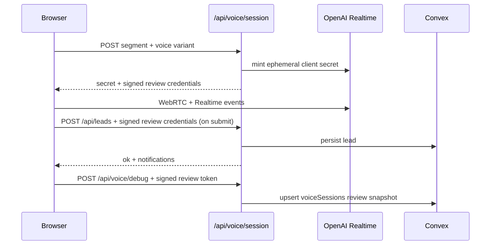

# Agent guide — Oriental Website

**Read this file first.** It is the canonical onboarding doc for humans and coding agents. `CLAUDE.md` includes this file verbatim for Cursor/Claude sessions.

---

<!-- BEGIN:nextjs-agent-rules -->
## Next.js 16 (required)

This is **not** the Next.js from training data. APIs, conventions, and file structure differ.

Before writing or changing Next.js code, read the relevant guide under `node_modules/next/dist/docs/` and follow deprecation notices in the codebase.
<!-- END:nextjs-agent-rules -->

---

## What this repo is

Production microsite for **Oriental Building** partner intake at `oriental.mereka.io`.

| Concern | Implementation |
|--------|----------------|
| UI | Next.js 16 App Router, React 19, Tailwind v4, shadcn/ui (`components/ui/`) |
| Content | `lib/content.ts` + section components in `components/site/` |
| Leads | Convex (`convex/schema.ts`, `convex/leads.ts`) via `lib/server/convex.ts` |
| Voice | OpenAI Realtime over WebRTC; production control is `gpt-realtime-2`, quality candidate is `gpt-realtime-2.1`, ephemeral tokens from `POST /api/voice/session` |
| Abuse | Optional Turnstile enforcement for form/newsletter posts + Redis-backed rate limits with memory fallback (`lib/server/rate-limit.ts`, re-exported by `security.ts`) |
| Notify | AWS SES/SMTP + Slack Web API bot token, webhook fallback (`lib/server/notifications.ts`, `lib/server/smtp.ts`) |
| Observability | Sentry Next.js SDK, structured JSON logs, Slack ops alerts, admin review dashboard |
| Deploy | Docker `output: "standalone"` on Coolify app `mtrl2z6a7zvoyevxvufpntij`; secrets from Infisical (not in git) |

**Product intent** lives in `docs/` (PRD, design, voice spec, API contracts). **Runtime truth** is this repo. Launch production uses **Convex**, **Redis-backed rate limiting via `REDIS_URL`**, structured JSON route logs, and Slack delivery to `#tech-team-test` through `SLACK_BOT_TOKEN` + `SLACK_CHANNEL_ID`.

---

## Repository map (runtime truth)

```
app/
  layout.tsx              # fonts, VoiceProvider, SiteNav, VoiceRail, Toaster
  page.tsx                # RSC home — composes site sections
  globals.css             # @theme tokens (Tailwind v4)
  api/
    leads/route.ts        # form/voice lead POST
    newsletter/route.ts   # hero email capture
    admin/                # token-gated admin review JSON endpoints
    voice/session/route.ts
    health/route.ts
  admin/session-review/   # token-gated lead + voice session review dashboard
components/
  admin/                  # admin login/review UI helpers
  site/                   # Hero, sections, Timeline, VoiceRail
  voice-agent/            # dialog, hooks, voice-state, HeroEmailCapture
  orb/                    # MerekaMiniMark (canonical SVG brand mark)
  ui/                     # shadcn primitives — prefer extending, not replacing
  security/               # Turnstile compatibility provider
  voice/                  # Turnstile hook
lib/
  content.ts              # copy constants
  segments.ts             # partner segments + routing metadata
  schemas.ts              # Zod request shapes (API + client)
  voice/
    profile.ts            # VOICE_PROFILE — instructions, tools, session tuning
    latency.ts            # bounded turn/activation latency reducer and telemetry
    runtime-profile.ts    # baseline/instant-v1 endpointing policies
    realtime-events.ts    # pure event reducer (tested)
    client-events.ts      # client-side event helpers
  server/
    convex.ts             # lead persistence
    admin-auth.ts         # signed admin review cookie/token helpers
    openai-realtime.ts    # session minting
    ops-alerts.ts         # Slack ops alerts for production failures
    security.ts           # Turnstile verifier, IP hash, shared response helpers
    rate-limit.ts         # Redis/Valkey/Upstash limiter, memory fallback
    logger.ts             # structured JSON logs for route handlers
    notifications.ts      # SES + Slack
convex/                   # schema + mutations; deploy with convex deploy
scripts/                  # operator/eval/deploy tooling; never imported by app runtime
tests/                    # vitest unit tests (*.test.ts)
tests/e2e/                # Playwright
docs/                     # handover specs — reference, not auto-synced to code
```

---

## Where to change what

| Goal | Start here |
|------|------------|
| Marketing copy / section order | `lib/content.ts`, `components/site/Sections.tsx`, `app/page.tsx` |
| Facilities layout (audiences, pillars, spaces) | `components/site/FacilitiesBands.tsx`, `.facilities-*` in `app/globals.css` |
| Ecosystem grid + footer CTA | `components/site/EcosystemGrid.tsx`, `.eco-*` / `.voice-cta` in `app/globals.css` |
| Partners grid + relevant block | `components/site/PartnersBands.tsx`, `.partner-*` / `.partners-relevant` in `app/globals.css` |
| Hero email capture styling | `components/voice-agent/HeroEmailCapture.tsx`, `.hero-email*` in `app/globals.css` |
| Mobile nav menu | `components/site/SiteNav.tsx`, `.site-nav__mobile*` in `app/globals.css` |
| Timeline layout | `components/site/Timeline.tsx`, `.timeline*` classes in `app/globals.css` |
| Nav active section underline | `components/site/SiteNav.tsx`, `.site-nav__link--active` |
| Partner segments, openers, routing labels | `lib/segments.ts` |
| Voice persona, guardrails, tool descriptions, VAD/transcription/timeouts | `lib/voice/profile.ts` |
| Voice A/B variants (distinct Malaysian registers: voice/speed/persona) + tuning picker (dev, or prod via `/?voices=1`) | `lib/voice/variants.ts`, `components/voice-agent/VoiceVariantPicker.tsx`; selected voice persists in localStorage/cookie |
| Realtime protocol / transcript state machine / capture grounding | `lib/voice/realtime-events.ts` + `tests/realtime-events.test.ts` |
| Voice UI / WebRTC wiring | `components/voice-agent/useRealtimeVoiceSession.ts`, `useVoiceRuntime.ts`, `VoiceAgentDialog.tsx`, `VoiceSessionStage.tsx` |
| Voice orb look & motion | `components/voice-agent/VoiceSessionStage.tsx`, `.voice-orb*` in `app/globals.css`, level source in `useVoiceAudioLevel.ts` |
| Session token + server session config | `app/api/voice/session/route.ts`, `lib/server/openai-realtime.ts` |
| Admin session review | `app/admin/session-review/page.tsx`, `app/api/admin/*`, `components/admin/*` |
| Admin dark theme / login / command palette | `app/admin/layout.tsx`, `app/admin/theme.css`, `components/admin/AdminLoginForm.tsx`, `components/admin/AdminCommandPalette.tsx` |
| On-demand voice evals (admin) | `app/api/admin/evals/route.ts`, `lib/server/voice-evals.ts`, `components/admin/AdminRunEvalsButton.tsx`; judge model via `EVAL_JUDGE_MODEL` |
| Sentry setup | `sentry.*.config.ts`, `instrumentation.ts`, `instrumentation-client.ts`, `next.config.ts` |
| Ops Slack alerts | `lib/server/ops-alerts.ts`; production target is `OPS_ALERT_SLACK_CHANNEL_ID` |
| Lead payload validation | `lib/schemas.ts` |
| Owner email env mapping | `lib/server/notifications.ts` + `OWNER_*` in `.env.local.example` |
| Shared rate limits | `lib/server/rate-limit.ts`; production should log `rateLimitStore: "redis"` |
| Structured route logs | `lib/server/logger.ts`; view in Coolify app logs |
| Infisical/Coolify deployment env | `/deploy/oriental-website`; `COOLIFY_ORIENTAL_APPLICATION_UUID=mtrl2z6a7zvoyevxvufpntij` |
| Convex tables / ingest | `convex/schema.ts`, `convex/leads.ts` |
| API error shapes | Source route handlers and `lib/schemas.ts`; update `docs/06-API-CONTRACTS.md` in the same PR |
| Styles / tokens | `app/globals.css` (`@theme`), component Tailwind classes |
| SEO / metadata | `app/layout.tsx`, `app/sitemap.ts`, `app/robots.ts` |

After voice behavior changes, run `pnpm test` (profile + realtime reducers) before shipping.
When voice capture or submission changes, run both staging smoke commands. The
intake smoke uses `qa.nebula@example.test`, never submits a lead, and is
excluded from customer-quality aggregates.

---

## Commands

```bash
pnpm install
pnpm dev                    # http://127.0.0.1:3000
pnpm lint                   # biome check
pnpm format                 # biome format --write
pnpm typecheck
pnpm test                   # vitest
pnpm build
pnpm test:e2e               # needs app; README uses PORT=3011 for standalone proof
pnpm build && pnpm test:performance  # production mobile LCP/CLS/JS/a11y gate
pnpm check-secrets          # validate expected env keys (local)
pnpm local:ngrok -- --check  # prove ngrok secret lookup without opening a tunnel
pnpm smoke:staging:voice    # real canonical-staging WebRTC/audio/persistence proof
pnpm smoke:staging:intake   # grounded adaptive email capture/no-confirmation/no-submit proof
pnpm eval:voice -- --aggregate-only --limit 100  # Query-only aggregate/gates + PII-free tool latency; no reports/writes
pnpm --silent ops:status --json  # machine-readable live/repo/review/work-queue truth
pnpm release:preflight -- --sha <full-main-sha>  # requires managed release env
pnpm release:deploy:production -- --sha <full-sha> --expected-current-sha <full-sha>
pnpm release:verify -- --sha <full-sha> --target staging|production|both
pnpm voice:debug             # inspect latest local voice debug snapshots
pnpm exec convex deploy     # needs CONVEX_DEPLOY_KEY
```

Copy `.env.local.example` → `.env.local` for local work. Never commit secrets. Production values come from Infisical/Coolify.

---

## Release governance (required)

Read [`docs/12-CHAT-RELEASE-RUNBOOK.md`](docs/12-CHAT-RELEASE-RUNBOOK.md)
before any deployment. For runtime work:

0. Run `pnpm --silent ops:status --json`; do not reconstruct current state from chat
   history. GitHub issues/PRs are the durable work queue.

1. Put runtime code, tests, specs/docs, configuration contract, and relevant
   agent guidance in one PR.
2. Merge once, update local `main`, and freeze the full merge SHA.
3. Inject the production app contract from Infisical and run
   `pnpm release:preflight -- --sha <sha>`; managed cell validation is mandatory.
4. Deploy/prove staging, then deploy production through the Coolify API.
5. Run `pnpm release:verify -- --sha <sha> --target both` and inspect the
   running containers' revision and cells.

Do not force an application rebuild for a docs/operator-only commit with no
runtime impact. Do not create late cleanup PRs after the final-SHA freeze; if a
runtime or release-contract correction is required, return to one PR and freeze
a new SHA. The operational target is 30 minutes; at 45 minutes, stop retrying
and diagnose the blocking boundary.

Staging is shared. `scripts/deploy-coolify-host.sh --target staging` requires
`--expected-current-sha`; a mismatch means another workflow moved the
environment. Stop and coordinate—never overwrite an unknown staging proof.
Model previews also require explicit `--voice-model-cell candidate`; the
default is control and every production host path rejects candidate. Verify a
candidate staging deployment with `--staging-model-cell candidate` while
production remains control.
`VOICE_VARIANT_PICKER=false` governs both `/api/client-config` and the actual
browser controls. Client tuner code must fetch that runtime route and fail
closed; query strings or local storage may hide an allowed picker but must
never bypass a disabled environment.

Realtime model changes are experiments, not string upgrades. Hold runtime,
reasoning, voice, device, and scripted corpus constant while comparing
`gpt-realtime-2` with `gpt-realtime-2.1`. `gpt-realtime-2.1-mini` is a separate
speed/cost candidate and MUST NOT be combined with that first comparison.

### APR review (required for release-sensitive changes)

Use the checked-out Automated Plan Reviser Pro binary, not browser automation,
for adversarial review of voice, security, data-integrity, and release-governance
changes. Keep the contract, evidence, workflow, and saved rounds under `.apr/`
so another agent can resume without chat history.

```bash
apr robot validate <round> -w <workflow>
apr robot run <round> -w <workflow> -i
```

If `apr` is not on `PATH`, use `$HOME/automated_plan_reviser_pro/apr` or install
the upstream tool; do not substitute a browser agent.

Read `.apr/rounds/<workflow>/round_<round>.md` completely, address every ship
blocker, update executable evidence, and rerun the next round until the workflow's
exact ship verdict is present. A wrapper truncation warning is not a verdict;
the saved round file is authoritative. APR complements tests and staged proof—it
does not replace either—and candidate evidence can never be inferred from a
review verdict.

---

## Conventions

- **Package manager:** pnpm (`packageManager` field in `package.json`).
- **Lint/format:** Biome — double quotes, semicolons, 120 cols (`biome.json`). `docs/` is excluded from Biome.
- **Imports:** `@/` path alias → repo root (`tsconfig.json`).
- **TypeScript:** `strict`, `noUncheckedIndexedAccess` — avoid `any`; Biome warns on explicit `any`.
- **API routes:** `export const runtime = "nodejs"` and `dynamic = "force-dynamic"` where applicable; responses via `noStoreJson` from security helper.
- **Client boundaries:** `"use client"` only for voice modal, Turnstile, interactive chrome; keep pages/sections RSC when possible.
- **Generated code:** Do not hand-edit `convex/_generated/`; run `pnpm convex:codegen` after schema changes.
- **Scope:** Minimal diffs; match existing naming and file placement; no drive-by refactors.

---

## Voice subsystem (quick model)



- **Profile:** `VOICE_PROFILE` in `lib/voice/profile.ts` drives instructions, tools, turn detection, truncation.
- **Capture:** governed staging/production use `VOICE_EMAIL_CAPTURE_MODE=adaptive`; accept only syntax-valid, independently grounded latest-turn evidence. A completed correction immediately invalidates the prior email verification before routing; duplicate email tool calls re-ground, and pending transcription relaxes capture only when no completed turn contradicts it. Typed edits also invalidate any already-active response for email mutation or routing. `strict` is the exact-readback/confirmation rollback. Never loosen the reducer or API submission boundary to achieve lower friction.
- **Events:** `lib/voice/realtime-events.ts` handles grounded state/tool events; `lib/voice/latency.ts` handles bounded turn and PII-free per-tool timings. Persist each completed tool sample to review metadata immediately—`wait_for_user` may have no later response. Never persist arguments, call IDs, contact values, or raw browser timestamps. Add focused tests for either reducer.
- **Responsive voice UI:** preserve explicit proof at 320x568, 360x800, 390x844, 844x390, 1024x600, 1280x720, and 1440x900 plus mobile-to-desktop resize. Assert the primary Start Voice action is initially visible before any scroll; `scrollIntoView` proves reachability, not fit. At >=1024 all three panes scroll independently.
- **Specs:** `docs/05-VOICE-AGENT-SPEC.md` covers product flow and `docs/13-VOICE-INSTANT-RELEASE-SPEC.md` covers the staged latency/endpointing release contract; verify both against code before assuming parity.

---

## Documentation index

Read in order on first pass, then cherry-pick:

| Doc | Use when |
|-----|----------|
| [`docs/README.md`](docs/README.md) | Handover index and key decisions |
| [`docs/01-PRD.md`](docs/01-PRD.md) | Product scope and success criteria |
| [`docs/02-TECHNICAL-SPEC.md`](docs/02-TECHNICAL-SPEC.md) | Intended stack (check drift vs Convex) |
| [`docs/05-VOICE-AGENT-SPEC.md`](docs/05-VOICE-AGENT-SPEC.md) | Voice UX, tools, conversation flow |
| [`docs/06-API-CONTRACTS.md`](docs/06-API-CONTRACTS.md) | Route payloads and error codes |
| [`docs/07-DATA-MODEL.md`](docs/07-DATA-MODEL.md) | Lead fields (Convex schema in `convex/schema.ts`) |
| [`docs/08-COMPONENT-MAP.md`](docs/08-COMPONENT-MAP.md) | Current production component map |
| [`docs/09-LAUNCH-CHECKLIST.md`](docs/09-LAUNCH-CHECKLIST.md) | Pre-launch gates |
| [`docs/11-INFRASTRUCTURE.md`](docs/11-INFRASTRUCTURE.md) | Coolify, Cloudflare, Infisical |
| [`docs/13-VOICE-INSTANT-RELEASE-SPEC.md`](docs/13-VOICE-INSTANT-RELEASE-SPEC.md) | Instant voice requirements, evidence gates, rollout, rollback |
| [`docs/14-PERFORMANCE-BUDGET.md`](docs/14-PERFORMANCE-BUDGET.md) | Mobile LCP, CLS, initial-JS, and accessibility budgets |
| [`docs/ASSET-SOURCES.md`](docs/ASSET-SOURCES.md) | Logo and favicon provenance |
| [`README.md`](README.md) | Human quickstart, env list, standalone run |

---

## Agent guardrails

- Do **not** commit `.env*`, API keys, or deploy keys.
- Do **not** run destructive git commands unless the user explicitly asks.
- Do **not** assume Vercel edge/runtime — hosting is Coolify Node standalone.
- Do **not** run interactive `infisical login`; use Universal Auth from `~/.config/infisical/universal-auth.env`.
- Do **not** use generic Coolify UUID secrets for this app; use `COOLIFY_ORIENTAL_APPLICATION_UUID` when scripting against Coolify.
- Do **not** expand scope: no new abstractions for one-off helpers; no unrelated README/doc sweeps unless asked.
- **Do** run `pnpm lint`, `pnpm typecheck`, and `pnpm test` when touching voice, API, or schemas.
- The Vitest pool is intentionally capped at four workers so full validation
  stays reliable on high-core shared agents; do not remove the cap based only
  on logical CPU count.
- **Do** update specs, runbooks, and this file in the same PR when runtime architecture, deployment, configuration, or agent workflow changes.
- **Do not** use `agent-browser` for release proof; use the checked-in Playwright e2e/smoke scripts and deterministic HTTP verifier.
- **Do** write chat/ACFS findings into a spec, issue, or PR immediately. Shared
  chats are intake, never the system of record.
- For local voice debugging, inspect `GET /api/voice/debug` while `NODE_ENV !== "production"`. Production review snapshots use signed per-session review tokens and persist to Convex `voiceSessions`.
- Do not paste or commit real tester transcripts. Summarise issues and clear/restart the dev server when a local debug buffer has sensitive data.
- Brand assets are local under `public/assets/brand/`; provenance is documented in `docs/ASSET-SOURCES.md`. Root `/favicon.ico` and `/apple-touch-icon.png` should keep serving the Mereka favicon.

---

## Convex deployment

Production deployment URL is documented in `README.md`. Deploy functions with a scoped key:

```bash
CONVEX_DEPLOY_KEY='prod:...' pnpm exec convex deploy
```

Regenerated bindings under `convex/_generated` stay committed.

---

*When unsure: prefer this file and source code over stale handover paragraphs. Update this file when architecture or canonical paths change.*
