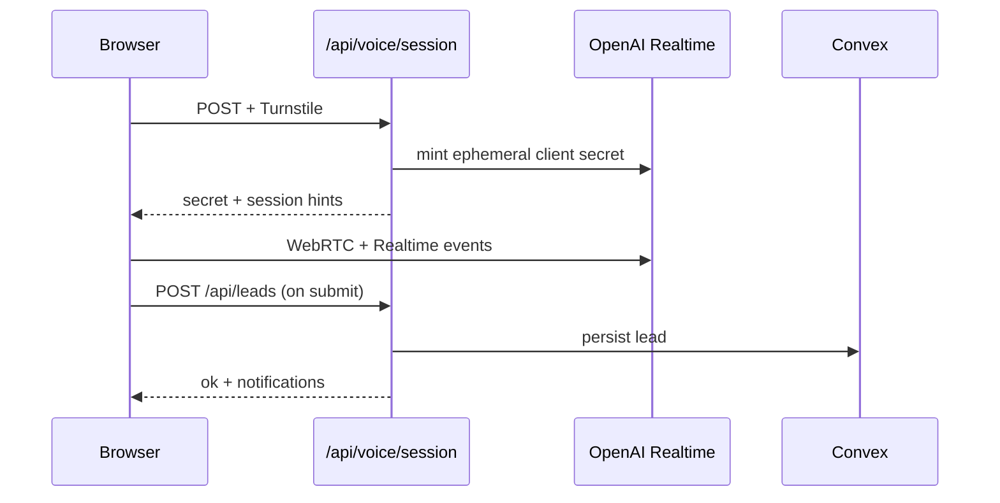

# Agent guide — Oriental Website

**Read this file first.** It is the canonical onboarding doc for humans and coding agents. `CLAUDE.md` includes this file verbatim for Cursor/Claude sessions.

---

<!-- BEGIN:nextjs-agent-rules -->
## Next.js 16 (required)

This is **not** the Next.js from training data. APIs, conventions, and file structure differ.

Before writing or changing Next.js code, read the relevant guide under `node_modules/next/dist/docs/` and follow deprecation notices in the codebase.
<!-- END:nextjs-agent-rules -->

---

## What this repo is

Production microsite for **Oriental Building** partner intake at `oriental.mereka.io`.

| Concern | Implementation |
|--------|----------------|
| UI | Next.js 16 App Router, React 19, Tailwind v4, shadcn/ui (`components/ui/`) |
| Content | `lib/content.ts` + section components in `components/site/` |
| Leads | Convex (`convex/schema.ts`, `convex/leads.ts`) via `lib/server/convex.ts` |
| Voice | OpenAI Realtime (`gpt-realtime-2`), WebRTC client, ephemeral tokens from `POST /api/voice/session` |
| Abuse | Cloudflare Turnstile + in-memory rate limits (`lib/server/security.ts`) |
| Notify | AWS SES + Slack webhook (`lib/server/notifications.ts`, `lib/server/smtp.ts`) |
| Deploy | Docker `output: "standalone"` on Coolify; secrets from Infisical (not in git) |

**Product intent** lives in `docs/` (PRD, design, voice spec, API contracts). **Runtime truth** is this repo — when docs mention Postgres/Drizzle/Redis, treat that as handover drift; production uses **Convex** and **in-memory** rate limiting unless a PR explicitly migrates storage.

---

## Repository map (runtime truth)

```
app/
  layout.tsx              # fonts, VoiceProvider, SiteNav, VoiceRail, Toaster
  page.tsx                # RSC home — composes site sections
  globals.css             # @theme tokens (Tailwind v4)
  api/
    leads/route.ts        # form/voice lead POST
    newsletter/route.ts   # hero email capture
    voice/session/route.ts
    health/route.ts
components/
  site/                   # Hero, sections, Timeline, VoiceRail
  voice-agent/            # dialog, hooks, voice-state, HeroEmailCapture
  orb/                    # MiniOrb (SVG)
  ui/                     # shadcn primitives — prefer extending, not replacing
  security/               # Turnstile hook
lib/
  content.ts              # copy constants
  segments.ts             # partner segments + routing metadata
  schemas.ts              # Zod request shapes (API + client)
  voice/
    profile.ts            # VOICE_PROFILE — instructions, tools, session tuning
    realtime-events.ts    # pure event reducer (tested)
    client-events.ts      # client-side event helpers
  server/
    convex.ts             # lead persistence
    openai-realtime.ts    # session minting
    security.ts           # Turnstile, rate limit, IP hash
    notifications.ts      # SES + Slack
convex/                   # schema + mutations; deploy with convex deploy
tests/                    # vitest unit tests (*.test.ts)
tests/e2e/                # Playwright
docs/                     # handover specs — reference, not auto-synced to code
```

---

## Where to change what

| Goal | Start here |
|------|------------|
| Marketing copy / section order | `lib/content.ts`, `components/site/Sections.tsx`, `app/page.tsx` |
| Facilities layout (audiences, pillars, spaces) | `components/site/FacilitiesBands.tsx`, `.facilities-*` in `app/globals.css` |
| Ecosystem grid + footer CTA | `components/site/EcosystemGrid.tsx`, `.eco-*` / `.voice-cta` in `app/globals.css` |
| Partners grid + relevant block | `components/site/PartnersBands.tsx`, `.partner-*` / `.partners-relevant` in `app/globals.css` |
| Hero email capture styling | `components/voice-agent/HeroEmailCapture.tsx`, `.hero-email*` in `app/globals.css` |
| Mobile nav menu | `components/site/SiteNav.tsx`, `.site-nav__mobile*` in `app/globals.css` |
| Timeline layout | `components/site/Timeline.tsx`, `.timeline*` classes in `app/globals.css` |
| Nav active section underline | `components/site/SiteNav.tsx`, `.site-nav__link--active` |
| Partner segments, openers, routing labels | `lib/segments.ts` |
| Voice persona, guardrails, tool descriptions, VAD/timeouts | `lib/voice/profile.ts` |
| Realtime protocol / transcript state machine | `lib/voice/realtime-events.ts` + `tests/realtime-events.test.ts` |
| Voice UI / WebRTC wiring | `components/voice-agent/useRealtimeVoiceSession.ts`, `VoiceAgentDialog.tsx` |
| Session token + server session config | `app/api/voice/session/route.ts`, `lib/server/openai-realtime.ts` |
| Lead payload validation | `lib/schemas.ts` |
| Owner email env mapping | `lib/server/notifications.ts` + `OWNER_*` in `.env.local.example` |
| Convex tables / ingest | `convex/schema.ts`, `convex/leads.ts` |
| API error shapes | Match `docs/06-API-CONTRACTS.md`; implement in route handlers |
| Styles / tokens | `app/globals.css` (`@theme`), component Tailwind classes |
| SEO / metadata | `app/layout.tsx`, `app/sitemap.ts`, `app/robots.ts` |

After voice behavior changes, run `pnpm test` (profile + realtime reducers) before shipping.

---

## Commands

```bash
pnpm install
pnpm dev                    # http://127.0.0.1:3000
pnpm lint                   # biome check
pnpm format                 # biome format --write
pnpm typecheck
pnpm test                   # vitest
pnpm build
pnpm test:e2e               # needs app; README uses PORT=3011 for standalone proof
pnpm check-secrets          # validate expected env keys (local)
pnpm exec convex deploy     # needs CONVEX_DEPLOY_KEY
```

Copy `.env.local.example` → `.env.local` for local work. Never commit secrets. Production values come from Infisical/Coolify.

---

## Conventions

- **Package manager:** pnpm (`packageManager` field in `package.json`).
- **Lint/format:** Biome — double quotes, semicolons, 120 cols (`biome.json`). `docs/` is excluded from Biome.
- **Imports:** `@/` path alias → repo root (`tsconfig.json`).
- **TypeScript:** `strict`, `noUncheckedIndexedAccess` — avoid `any`; Biome warns on explicit `any`.
- **API routes:** `export const runtime = "nodejs"` and `dynamic = "force-dynamic"` where applicable; responses via `noStoreJson` from security helper.
- **Client boundaries:** `"use client"` only for voice modal, Turnstile, interactive chrome; keep pages/sections RSC when possible.
- **Generated code:** Do not hand-edit `convex/_generated/`; run `pnpm convex:codegen` after schema changes.
- **Scope:** Minimal diffs; match existing naming and file placement; no drive-by refactors.

---

## Voice subsystem (quick model)



- **Profile:** `VOICE_PROFILE` in `lib/voice/profile.ts` drives instructions, tools, turn detection, truncation.
- **Events:** `lib/voice/realtime-events.ts` is the pure reducer; add tests in `tests/realtime-events.test.ts`.
- **Spec:** `docs/05-VOICE-AGENT-SPEC.md` for product flow; verify against code before assuming parity.

---

## Documentation index

Read in order on first pass, then cherry-pick:

| Doc | Use when |
|-----|----------|
| [`docs/README.md`](docs/README.md) | Handover index and key decisions |
| [`docs/01-PRD.md`](docs/01-PRD.md) | Product scope and success criteria |
| [`docs/02-TECHNICAL-SPEC.md`](docs/02-TECHNICAL-SPEC.md) | Intended stack (check drift vs Convex) |
| [`docs/05-VOICE-AGENT-SPEC.md`](docs/05-VOICE-AGENT-SPEC.md) | Voice UX, tools, conversation flow |
| [`docs/06-API-CONTRACTS.md`](docs/06-API-CONTRACTS.md) | Route payloads and error codes |
| [`docs/07-DATA-MODEL.md`](docs/07-DATA-MODEL.md) | Lead fields (conceptual; schema in `convex/schema.ts`) |
| [`docs/08-COMPONENT-MAP.md`](docs/08-COMPONENT-MAP.md) | Prototype → component mapping |
| [`docs/09-LAUNCH-CHECKLIST.md`](docs/09-LAUNCH-CHECKLIST.md) | Pre-launch gates |
| [`docs/11-INFRASTRUCTURE.md`](docs/11-INFRASTRUCTURE.md) | Coolify, Cloudflare, Infisical |
| [`README.md`](README.md) | Human quickstart, env list, standalone run |

---

## Agent guardrails

- Do **not** commit `.env*`, API keys, or deploy keys.
- Do **not** run destructive git commands unless the user explicitly asks.
- Do **not** assume Vercel edge/runtime — hosting is Coolify Node standalone.
- Do **not** expand scope: no new abstractions for one-off helpers; no unrelated README/doc sweeps unless asked.
- **Do** run `pnpm lint`, `pnpm typecheck`, and `pnpm test` when touching voice, API, or schemas.
- **Do** update `docs/` only when the user wants spec alignment; otherwise fix code and mention doc drift in the PR/summary.

---

## Convex deployment

Production deployment URL is documented in `README.md`. Deploy functions with a scoped key:

```bash
CONVEX_DEPLOY_KEY='prod:...' pnpm exec convex deploy
```

Regenerated bindings under `convex/_generated` stay committed.

---

*When unsure: prefer this file and source code over stale handover paragraphs. Update this file when architecture or canonical paths change.*
